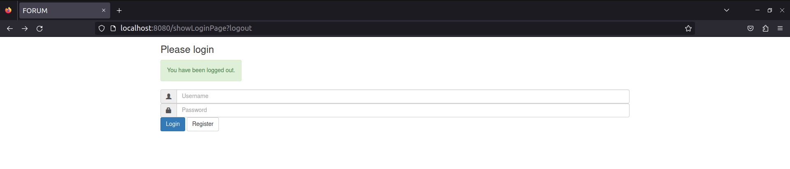
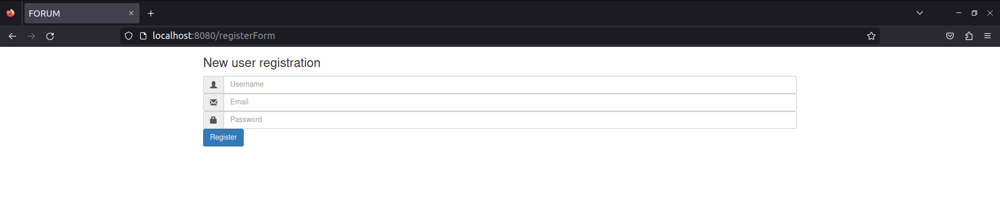
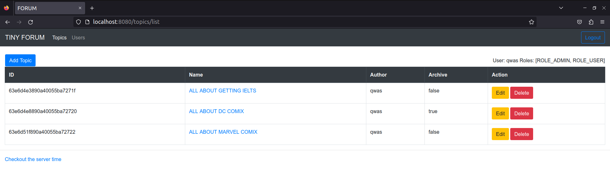
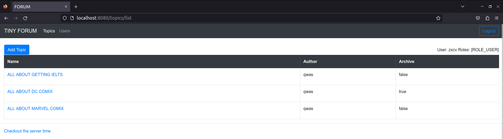
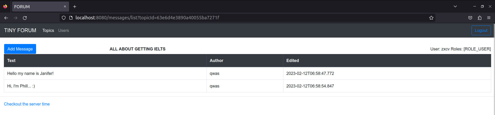

Forum 
---
Spring-Boot MVC App using Spring-Security, MongoDB JPA and Thymeleaf 

For further use in CI/CD Pipelines and infrastructure coding

Ready features:
- SignIn and LogIn features with Spring Security and Thymeleaf templates
- Simple RBAC with administrative features
- MongoDB storage
- Exception Handling
- Topics and messages

Upcoming updates:
- Spring-Boot Testing
- Pagination

